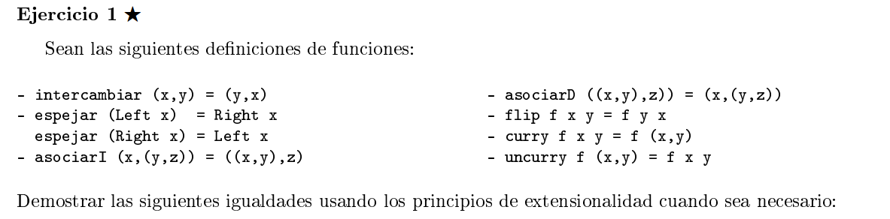

```haskell
{I} intercambiar (x,y) = (y,x)

{E1} espejar (Left x) = Right x
{E2} espejar (Right x) = Left x

{AI} asociarI (x,(y,z)) = ((x,y),z)

{AD} asociarD ((x,y),z)) = (x,(y,z))

{F} flip f x y = f y x

{C1} curry f x y = f (x,y)

{C2} uncurry f (x,y) = f x y
```   


```haskell
-- quiero ver que:
∀ p::(a,b) . intercambiar (intercambiar p) = p

usamos induccion sobre pares:

Para probar lo del enunciado, basta probar que:
∀x :: a, ∀y :: b. intercambiar (intercambiar (x,y)) = (x,y)

intercambiar (intercambiar (x,y)) = intercambiar (y,x) {I}
                                  = (x,y)              {I}
```

```haskell
-- quiero ver que:
∀ p::(a,(b,c)) : asociarD (asociarI p) = p

usamos induccion de pares

Para probar lo del enunciado, basta probar que:
∀x :: a, ∀y :: b, ∀z :: x. asociarD (asociarI (x,(y,z))) = (x,(y,z))

asociarD (asociarI (x,(y,z))) = asociarD ((x,y), z)   {AI}
                              = (x,(y,z))             {AD}
```

```haskell
-- quiero ver que:
∀ p::Either a b : espejar (espejar p) = p

Veamos que vale para los constructores del (Either a b).

espejar (espejar (Left x)) = espejar (Right x)       {ER}
                           = Left y                  {EL}


espejar (espejar (Right x)) = espejar (Left x)       {EL}
                           = Right y                  {ER}


```