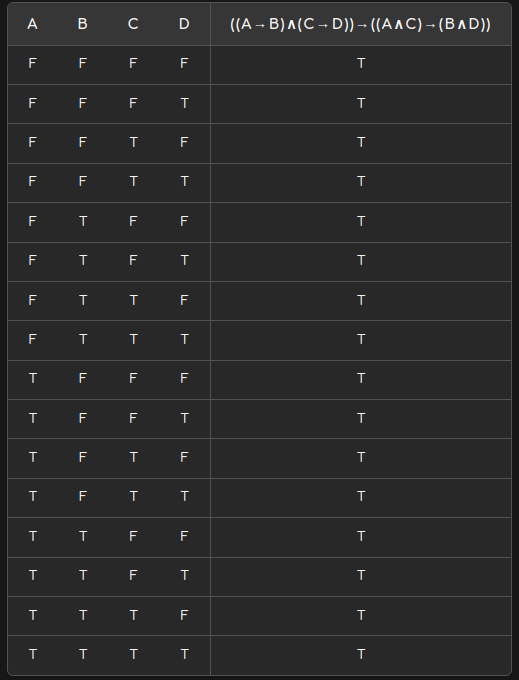

## iii.

```haskell  
Num a => ∀ p::Polinomio a. (sinConstantesNegativas p) sinConstantesNegativas (derivado p)
```


Recordemos de la practica 1

```haskell
-- {F0}
foldPoli :: b -> (a -> b) (Poli a -> Poli a -> b) (Poli a -> Poli a -> b) -> b
foldPoli cX fc fs fm p = case p of
    X           -> cX
    Cte k       -> fc k
    Suma q r    -> fs (foldPoli cX fc fs fm q) (foldPoli cX fc fs fm r)
    Prod q r    -> fp (foldPoli cX fc fs fm q) (foldPoli cX fc fs fm r)

-- {E0}
evaluar :: Num a => a -> Polinomio a -> a
evaluar n = foldPoli n id (+) (*)

-- {D0}
derivado :: Num a => Polinomio a -> Polinomio a
derivado poli = case poli of
    X -> Cte 1
    Cte _ -> Cte 0
    Suma p q -> Suma (derivado p) (derivado q)
    Prod p q -> Suma (Prod (derivado p) q) (Prod (derivado q) p)

-- {S0}
sinConstantesNegativas :: Num a => Polinomio a -> Polinomio a
sinConstantesNegativas = foldPoli (>=0) True (&&) (&&)
```

## Enunciado

Demostrar:

```haskell  
Num a => ∀ p::Polinomio a. (sinConstantesNegativas p) ⟹ sinConstantesNegativas (derivado p)
```


Lo probamos con induccion estructural sobre polinomios:

### Caso Base
```haskell  
-- quiero ver que vale para los contructores base:

-- X:
(sinConstantesNegativas X) ⟹ sinConstantesNegativas (derivado X)

(sinConstantesNegativas X)
= True                          {S0}
= (Cte 1) ≥ 0
= foldPoli (>=0) True (&&) (&&) (Cte 1)
= foldPoli (>=0) True (&&) (&&) (derivado X)
= sinConstantesNegativas (derivado X)

-- (Cte c):
(sinConstantesNegativas (Cte c)) ⟹ sinConstantesNegativas (derivado (Cte c))

(sinConstantesNegativas (Cte c))
= (Cte c) ≥ 0                               {S0}
    -- Caso (Cte c) ≥ 0
    = True
    = Cte 0 ≥ 0
    = sinConstantesNegativas (Cte 0)
    = sinConstantesNegativas (derivado (Cte c))

    -- Caso (Cte c < 0) es trivial : false --> cualquier cosa
```


### Paso inductivo
```haskell   
-- quiero ver que vale para todos los constructores recursivos:

-- HI 
∀ p::Polinomio a . ∀ q::Polinomio a .
(sinConstantesNegativas p) ⟹ sinConstantesNegativas (derivado p)
(sinConstantesNegativas q) ⟹ sinConstantesNegativas (derivado q)


-- (Suma p q) 
-- quiero ver que:
(sinConstantesNegativas (Suma p q)) ⟹ sinConstantesNegativas (derivado (Suma p q))

(sinConstantesNegativas (Suma p q))
= foldPoli (>=0) True (&&) (&&) (Suma p q)                                       {S0}
= (foldPoli (>=0) True (&&) (&&) p) && (foldPoli (>=0) True (&&) (&&) q)         {F0}
= sinConstantesNegativas p && sinConstantesNegativas q                           {S0}
⟹ sinConstantesNegativas (derivado p) && sinConstantesNegativas (derivado q)    {lema logico}
= sinConstantesNegativas (Suma (derivado p) (derivado q))
sinConstantesNegativas (derivado (Suma p q))


-- (Prod p q) , es lo mismo que arriba solo que con Prod en vez de Suma.
```

### Lema logico
```
((A -> B) && (C -> D)) -> ((A && B) -> (C && D))

Donde (A -> B) && (C -> D) son las HI.
````


  


