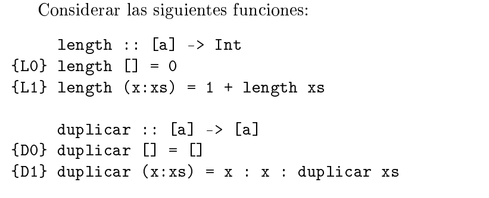
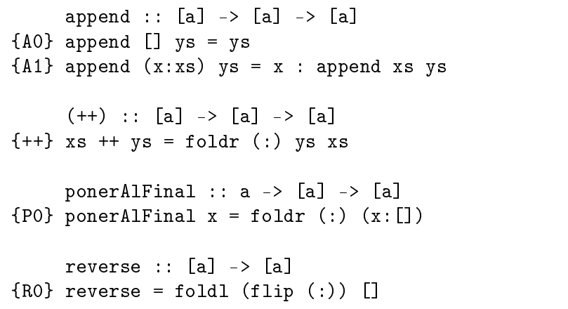

# Ejercicio 3
  


Demostrar las siguientes propiedades:

## i.
```haskell
∀ xs::[a] . length (duplicar xs) = 2 * length xs
```

Usamos induccion sobre listas:

### Caso Base:
```haskell
-- quiero ver que:
length (duplicar []) = 2 * length []

length (duplicar [])
= length []           {D0}
= 0                   {L0}
= 2 * 0               {def multiplicacion}
= 2 * length []       {L0}
```

### Caso inductivo:   
```haskell
-- HI
length (duplicar xs) = 2 * length xs

-- Quiero ver que:
length (duplicar (x:xs)) = 2 * length (x:xs)
```

```haskell
-- supongo que vale P(xs), quiero ver que vale tambien P(x:xs)
length (duplicar (x:xs))
= length (x:x:(duplicar xs))        {D1}
= 1 + length (x:(duplicar xs))      {L1}
= 1 + 1 + length (duplicar xs)      {L1}
= 2 + 2 * length xs                 {suma}
= 2 * (1 + length xs)               {asociatividad}
= 2 * lenghth(x:xs)                 {L1}
```

## ii.

```haskell
-- quiero ver que:
∀ xs::[a] . ∀ ys::[a] . length (append xs ys) = length xs + length ys
```

### Caso Base:
```haskell
-- quiero ver que:
length (append [] ys) = length [] + length ys

length (append [] ys) 
= length ys                 {A0}
= 0 + length ys         
= length [] + length ys     {L0}
```

### Caso inductivo:
```haskell
-- HI
length (append xs ys) = length xs + length ys

-- Quiero ver que:
length (append (x:xs) ys) = length (x:xs) + length ys
```

```haskell
-- supongo que vale P(xs), quiero ver que vale tambien P(x:xs)
length (append (x:xs) ys)       
= length (x : append xs ys)     {A1}
= 1 + length (append xs ys)     {L1}
= 1 + length xs + length ys     {HI}
= length (x:xs) + length ys     {L1}
```


## iii
```haskell
-- quiero ver que: 
∀ xs::[a] . ∀ x::a . [x] ++ xs = x:xs
```

### Caso Base:
```haskell
-- Quiero ver que:
[x] ++ [] = x:[]

[x] ++ []               
= foldr (:) [] [x]          {++}
= foldr (:) [] (x:[])       {def foldr}
= (:) x (foldr (:) [] [])   {def foldr}
= (:) x []                  {def foldr}
= x:[]                      {def (:)}
```


### Paso inductivo:
```haskell
-- HI
[x] ++ xs = x:xs

-- Quiero ver que:
[x] ++ (y:xs) = x:(y:xs)
```

```haskell
[x] ++ (y:xs) 
= foldr (:) (y:xs) [x]          {++}
= foldr (:) (y:xs) (x:[])       
= x : (foldr (:) (y:xs) [])     {def foldr}
= x : (y:xs)                    {def foldr}
```

## iv
```haskell
-- quiero ver que: 
∀ xs::[a] . ∀ f::(a->b) . length (map f xs) = length xs
```

### Caso Base:
```haskell
-- quiero ver que:
length (map f []) = length []

length (map f []) 
= lenght []         {M0}
```

### Paso inductivo:
```haskell
-- HI
length (map f xs) = length xs 

-- quiero ver que:
length (map f (x:xs)) = length (x:xs) 
```
```haskell
length (map f (x:xs))
= length ((f x) : map f xs)     {M1}
= 1 + length (map f xs)         {L1}
= 1 + length xs                 {HI}
= length (x:xs)                 {L1}
```


## v
```haskell
-- quiero ver que: 
∀ xs::[a] . ∀ p::a->Bool . ∀ e::a . ((elem e (filter p xs)) ⇒ (elem e xs))
```

### Caso Base:
```haskell
-- quiero ver que: 
(elem e (filter p [])) ⇒ (elem e [])

elem e (filter p [])    
= elem e ([])           {def filter}
= false                 {def elem}
⇒ (elem e [])           {falso implica cualquier cosa}
```


### Paso inductivo:
```haskell
-- HI
((elem e (filter p xs)) ⇒ (elem e xs))

-- quiero ver que:
((elem e (filter p (x:xs))) ⇒ (elem e (x:xs)))
```

```haskell
(elem e (filter p (x:xs)))

-- caso p x = true
= (elem e (x: filter p xs))        {def filter}
= x == e || elem e (filter p xs)   {def elem}
⇒ (x == e) || (elem e xs)          {HI}
= (elem e (x:xs))                  {def elem}

-- caso p x = false
= (elem e (filter p xs))           {def filter}
⇒ (elem e xs)                     {HI}
⇒ (elem e (x:xs))                 {def filter}
```


## vi
```haskell
-- quiero ver que: 
∀ xs::[a] . ∀ x::a . ponerAlFinal x xs = xs ++ (x:[])
```

### Caso Base:
```haskell
-- quiero ver que:
ponerAlFinal x [] = [] ++ (x:[])

ponerAlFinal x [] 
= x:[]                  {P0}
= foldr (:) [] (x:[])   {def foldr}
= [] ++ (x:[])          {++}
```


### Paso inductivo:
```haskell
-- HI:
ponerAlFinal x xs = xs ++ (x:[])

-- quiero ver que:
ponerAlFinal x (y:xs) = (y:xs) ++ (x:[])
```
```haskell
-- usamos el siguiente lema probado en clases:
{L1} x : (xs ++ ys) = (x:xs) ++ ys

ponerAlFinal x (y:xs)
= foldr (:) (x:[]) (y:xs)       {P0}
= y : (foldr (:) (x:[]) xs)     {def foldr}
= y : ponerAlFinal x xs         {P0}
= y : (xs ++ (x:[]))            {HI}
= (y : xs) ++ (x:[])            {L1}
```

## vii
```haskell
-- quiero ver que: 
reverse = foldr (\x rec -> rec ++ (x:[])) []
```

Por extensionalidad de funciones, basta con probar que:
```haskell
∀ xs::[a] . reverse xs = foldr (\x rec -> rec ++ (x:[])) [] xs
```
Para esto ultimo, vamos a usar induccion sobre listas

### Caso Base:
```haskell
-- quiero ver que:
reverse [] = foldr (\x rec -> rec ++ (x:[])) [] []

reverse []                                     
= []                                        {def reverse}
= foldr (\x rec -> rec ++ (x:[])) [] []     {def foldr}
```

### Paso inductivo:
```haskell
-- HI:
reverse xs = foldr (\x rec -> rec ++ (x:[])) [] xs

-- quiero ver que:
reverse (x:xs) = foldr (\x rec -> rec ++ (x:[])) [] (x:xs)
```

```haskell
-- se flipea el (:), ya que la funcion que toma foldl como parametro, debe 
-- tener como primer argumento, el acumulador.

reverse (x:xs)
= foldl (flip (:)) [] (x:xs)                {R0}
= foldl (flip (:)) (flip (:) [] x) xs       {def foldl}
= foldl (flip (:)) (x:[]) xs                {def flip}

= (foldl (flip (:)) [] xs) ++ [x]           {lema F}

= (reverse xs) ++ [x]                       {}
= (foldr (\x rec -> rec ++ (x:[])) [] xs) ++ [x]
= foldr (:) [x] (foldr (\x rec -> rec ++ (x:[])) [] xs)
```

```haskell
-- quiero ver que:
(foldr (\z rec -> rec ++ (z:[])) [] xs) ++ [x] = foldr (\y rec -> rec ++ (y:[])) [] (x:xs)

--Caso Base:
-- quiero ver que:
(foldr (\y rec -> rec ++ (y:[])) [] []) ++ [x] = foldr (\z rec -> rec ++ (z:[])) [] (x:[])

(foldr (\y rec -> rec ++ (x:[])) [] []) ++ [x] 
= [] ++ [x]
= [] ++ (x:[])
= (\z rec -> rec ++ (z:[])) x []
= (\z rec -> rec ++ (z:[])) x (foldr f [] [])
= foldr (\z rec -> rec ++ (z:[])) [] (x:[])


-- paso inductivo
-- quiero ver que:
(foldr (\z rec -> rec ++ (z:[])) [] (e:xs)) ++ [x] = foldr (\y rec -> rec ++ (y:[])) [] (x:e:xs)

-- comenzamos del lado izquierdo
foldr (\y rec -> rec ++ (y:[])) [] (x:xs)
= (\y rec -> rec ++ (y:[])) x (foldr f [] xs)
= (foldr f [] xs) ++ (x:[])
= (foldr (\y rec -> rec ++ (y:[])) [] xs) ++ (x:[])
= (foldr (\z rec -> rec ++ (z:[])) [] xs) ++ (x:[])
-- legamos al lado derecho :)

```


## viii
```haskell
-- quiero ver que: 
∀ xs::[a] . ∀ x::a . [x] ++ xs = x:xs
```

### Caso Base:
```haskell
-- quiero ver que:
```


### Paso inductivo:
```haskell
-- HI:

-- quiero ver que:

```
