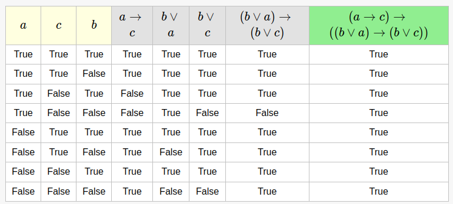

# Ejercicio 4

## vi.


```haskell
∀ f::a->b . ∀ e::a . ∀ xs::[a] . ((elem e xs)) ⟹ (elem (f e) (map f xs))
```

Lo probamos con induccion estructural sobre listas:

### Caso Base
```haskell
-- quiero ver que:
((elem e [])) ⟹ (elem (f e) (map f []))

((elem e []))
= false
false ⟹ (elem (f e) (map f []))
```

### Paso inductivo
```haskell   
-- HI :
((elem e xs)) ⟹ (elem (f e) (map f xs))

-- quiero ver que:
((elem e (x:xs))) ⟹ (elem (f e) (map f (x:xs)))

((elem e (x:xs)))
= x == e || (elem e xs)                       {def elem}
⟹ x == e || (elem (f e) (map f xs))         {HI , lema logico}
⟹ (f e == f x) || (elem (f e) (map f xs))
= (elem (f e) (f x : map f xs))
= (elem (f e) (map f (x:xs)))
```


## Lema (logico)

``` 
(A --> C) --> ((B v A) --> (B v C))

Donde (A --> C) es la HI en este caso.
```
