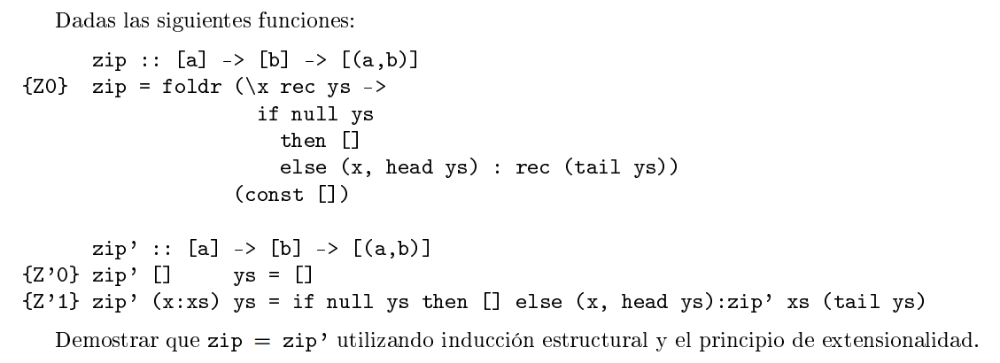

## Ejercicio 5



```haskell  
-- Z1
zip = foldr (\x rec ys ->
    if null ys
        then []
        else (x, head ys) : rec (tail ys))
    (const [])
```


```haskell  
-- Z'0
zip' [] ys = []
-- Z'1
zip' (x:xs) ys = 
    if null ys 
        then [] 
        else (x, head ys) : zip' xs (tail ys)
```


## iii.

```haskell    
zip = zip'
```

Por principio de extensionalidad sobre listas, basta con probar:
```haskell
∀ xs::[a] . ∀ ys::[a] . zip xs ys = zip' xs ys
```
Lo probamos con induccion estructural sobre listas:

### Caso Base
```haskell  
-- quiero ver que:
zip [] ys = zip' [] ys

zip [] ys
= foldr (\x rec ys ->                       {Z0}
    if null ys
        then []
        else (x, head ys) : rec (tail ys))
    (const []) [] ys
= const [] ys                               {def foldr}
= []    
= zip' [] ys                                {Z'0}
```

### Paso inductivo
```haskell   
-- HI :
zip xs ys = zip' xs ys

-- quiero ver que:
zip (x:xs) ys = zip' (x:xs) ys

zip (x:xs) ys
= foldr (\x' rec ys' ->                       {Z0}
    if null ys'
        then []
        else (x' , head ys') : rec (tail ys'))
    (const []) (x:xs) ys

=   (\x' rec ys' ->                              {Z0}
        if null ys'
            then []
            else (x', head ys') : rec (tail ys')
    )
    x (foldr f (const []) xs) ys

=   if null ys                                      {β}
        then []
        else (x, head ys) : (foldr f (const []) xs) (tail ys)

=   if null ys                                      {Z0}
        then []
        else (x, head ys) : zip xs (tail ys)


-- caso null ys = true
= []                
= zip' (x:xs) []
= zip' (x:xs) ys

-- caso null ys = false
= (x, head ys) : zip xs (tail ys)
= (x, head ys) : zip' xs (tail ys)          {HI}
= zip' (x:xs) ys                            {Z'0}
```