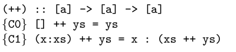

## vi.


```haskell    
Eq a => ∀ xs::[a] . ∀ ys::[a] . length (union xs ys) ≤ length xs + length ys 
```

Lo probamos con induccion estructural sobre listas:

### Caso Base
```haskell  
-- quiero ver que:
length (union [] ys) ≤ length [] + length ys 

length (union [] ys)
= length (nub([] ++ ys))    {U0}
≤ length ([] ++ ys)         {lema}
= length (ys)              
= 0 + length ys     
= length [] + length ys     {L0}

-- vale el ≤ por transitividad
```

### Paso inductivo
```haskell   
-- HI :
length (union xs ys) ≤ length xs + length ys 

-- quiero ver que:
length (union (x:xs) ys) ≤ length (x:xs) + length ys 

length (union (x:xs) ys)
= length (nub ((x:xs) ++ ys))
≤ length ((x:xs) ++ ys)         {lema 1}
= length (x:xs) ++ length ys           {lema 2}
```

## Lema 1

```haskell  
length (nub (xs ++ ys)) ≤ length (xs ++ ys)

Lo probamos con induccion estructural sobre listas:

### Caso Base
```haskell  
-- quiero ver que:
length (nub ([] ++ ys)) ≤ length ([] ++ ys)

length (nub ([] ++ ys))
= length ([] ++ ys)         
= length ()
-- ... mucho texto
```

### Paso inductivo
```haskell   
-- HI :

-- quiero ver que:

```


## lema 2




```haskell    
lenght (xs ++ ys) = length xs + length ys
```

Lo probamos con induccion estructural sobre listas:

### Caso Base
```haskell  
-- quiero ver que:
length ([] ++ ys) = length [] + length ys

length ([] ++ ys)
= length (ys)               {C0}
= 0 + length ys
= length [] + length ys     {L0}
```

### Paso inductivo
```haskell   
-- HI :
length (xs ++ ys) = length xs + length ys

-- quiero ver que:
length ((x:xs) ++ ys) = length (x:xs) + length ys

length ((x:xs) ++ ys) 
= length (x : (xs ++ ys))       {C1}
= 1 + length (xs ++ ys)         {L1}
= 1 + length (xs) + length ys   {HI}
= length (x:xs) + length ys     {L1}
```
