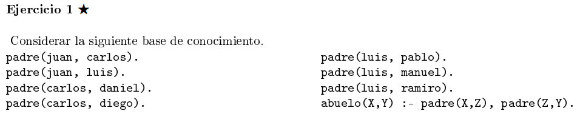
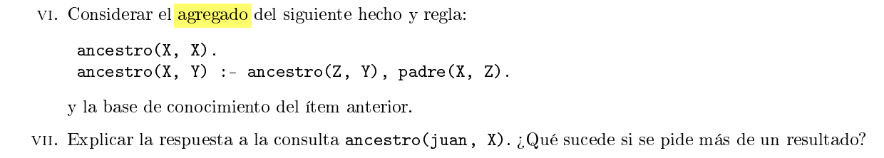

## i) Cuál el resultado de la consulta abuelo(X, manuel)?
Juan, ya que luis es el padre de manuel, y juan es el padre de luis.

## ii) A partir del predicado binario padre, definir en Prolog los predicados binarios: hijo, hermano y descendiente.

```pl

hijo(X,Y) :- padre(Y,X).

hermano(X,Y) :- padre(Z,X), padre(Z,Y).

descendiente(X,Y) :- padre(Y,X).
descenciente(X,Y) :- padre(Z,X), descendiente(Z,Y).

```


## iii) Que consulta habra que hacer para encontrar a los nietos de juan?

```pl
?- padre(juan, X), padre(X,Y).
```

De esta ^^^ forma obtenemos en Y todos los nietos de juan, y en X los padres de dichos nietos.

Si solo nos interesan los nietos, entonces podemos definir abuelo().

```pl
abuelo(X,Y) :- padre(X, Z), padre(Z, Y).

% luego hacemos la consulta
?- abuelo(juan, Y).
```


## v)  Cómo se puede definir una consulta para conocer a todos los hermanos de pablo?

```pl
?- padre(X, pablo), padre(X,Y), X \= Y.

% o podemos definir
hermano(X,Y) :- padre(Z,X), padre(Z,Y), X \= Y.

% y luego consultar
?- hermano(pablo, X).
```

## vi) , vii), vii) 


Cuando hacemos la consulta ```ancestor(juan, X)``` vamos a obetener todos los hijos y los nietos de juan, pero despues prolog va a seguir la busqueda y va a quedar stuckeado
buscando en la rama que se forma de tomar siempre la segunda definicion de ancestro, en la cual no estamos instanciando las variables

version corregida
```pl
ancestro(X,Y) :- padre(X,Y).
ancestro(X,Y) :- padre(Z,Y), ancestro(X,Z).
```


