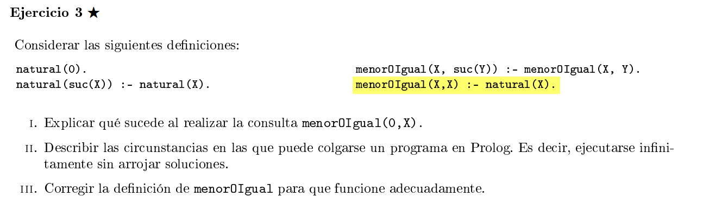
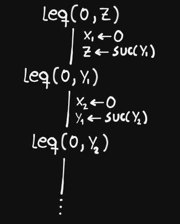

  

## i)


En cada paso obtenemos de resolucion siempre elegimos la primera regla, y obtenemos una resolvente que tiene una variable fresca sin instanciar, por lo que podemos repetir esto hasta el infinito.


## ii)
Un programa se puede colgar si por el orden de las reglas, quedamos atrapados en una rama
del arbol de busqueda, esto puedo ocurrir si en todos los casos obtenemos siempre una nueva resolvente y nunca llegamos a un caso base. 

## iii)

```pl
menorOIgual(X,X) :- natural(X).
menorOIgual(X, suc(Y)) :- menorOIgual(X,Y).
```


