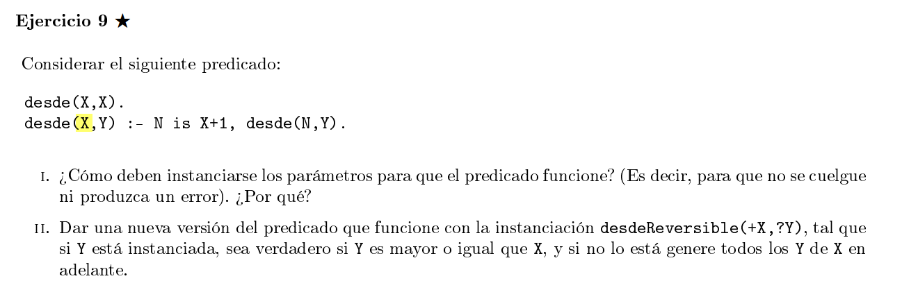

## i)

```pl
desde(+X,-Y)
```
Esta funcion nos da todos los numeros (inifinitos) desde X. 

X debe estar instanciada siempre, sino falla en el N is X+1.

Y no debe estar instanciada (se rompe). 

Si Y no esta instanciada, siempre va a poder unificar con la primera regla con Y := X, y como X toma todos los valores a partir del X inicial, obtengo todos los valores mayores a ese X.

Si Y esta instanciada, entonces tenemos 2 casos:
X <= Y : en este caso va a devolver true una vez, ya que al estar incrementando X va a llegar el punto en que X := Y y unifica con la priemra regla, pero luego va a seguir con la segunda regla y no va a unificar mas, se cuelga.

X > Y : en este caso se va a colgar de entrada, nunca va a poder unificar con ninguna regla y con la regla 2 va a hacer una rama infinitamente profunda.

## ii)

```pl
% desdeRev(+X, ?Y)
desdeRev(X,X).
desdeRev(X,Y) :- ground(Y), Y > X.
desdeRev(X,Y) :- var(Y), N is X+1, desde(N,Y).
```

Notemos que la primera y la segunda regla son mutuamente excluyentes.
Si X e Y estan instanciadas, queremos ver si Y >= X, por lo que
podemos separar esto es 2 condiciones mutex, Y == X o Y > X. 