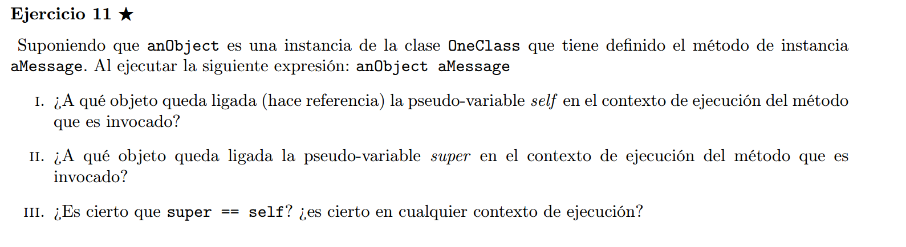

## I)
self queda ligada a anObject

## II)
super queda ligada a anObject, solo que si hacemos super aMessage, va a comenzar la busqueda del metodo q implementa aMessage en la superclase de OneClass. 

## III)
El ```==``` es para comparar identidad, en este caso ```super``` y  ```self``` no tienen la misma identidad, son meta-variables distintas...
Su comportamiento a la hora de buscar metodos (lookup) es distinto, asi que no son intercambiables en cualquier contexto...

Sin embargo, si comparamos con ```=``` estariamos comparando el contendio al que referencian las vars... en este caso si daria true en cualquier contexto, ya que referencian siempre al receptor.