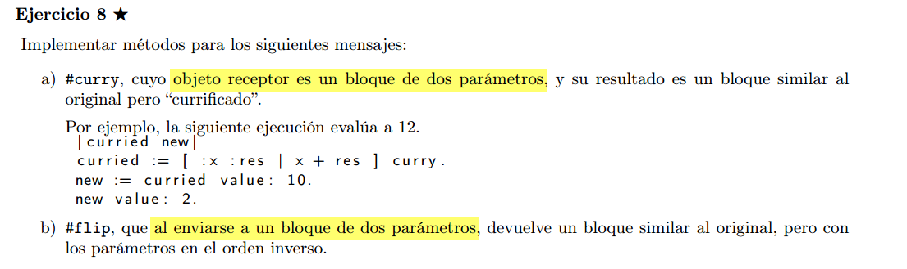
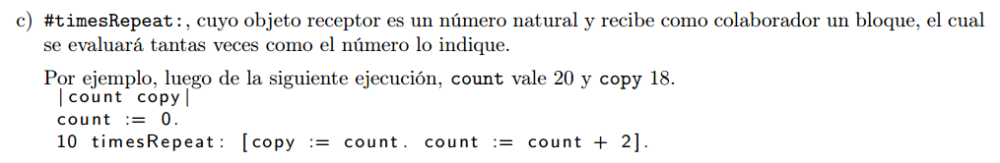

## a)

```
BlockClosure >> curry
    ^[ :x | [ :y | self value:x value:y ] ].
```
Notar que self se refiere al bloque original (sin currificar) que esta
recibiendo el mensaje #curry, este bloque siempre se ejecuta con 2 args.

Notar que cuando pasamos el primer arg al bloque currificado, este nos va
a devolver otro bloque que tenemos que guardar en una var si lo vamos a
querer usar mas adelante... no se modifica directamente el bloque original.


## b)

```
BlockClosure << flip
    ^[ :y :x | self value:x value:y ].
```

## c)



```
Integer << timesRepeat: aBlock
    |count|
    count := 1.
    [count <= self] whileTrue: [aBlock value. count := count + 1]


"aca hay otra version, pero tiene efecto secundario, modifica el self..."

Integer << timesRepeat: aBlock
    [self > 0] whileTrue: [aBlock value. self := self - 1]
```
